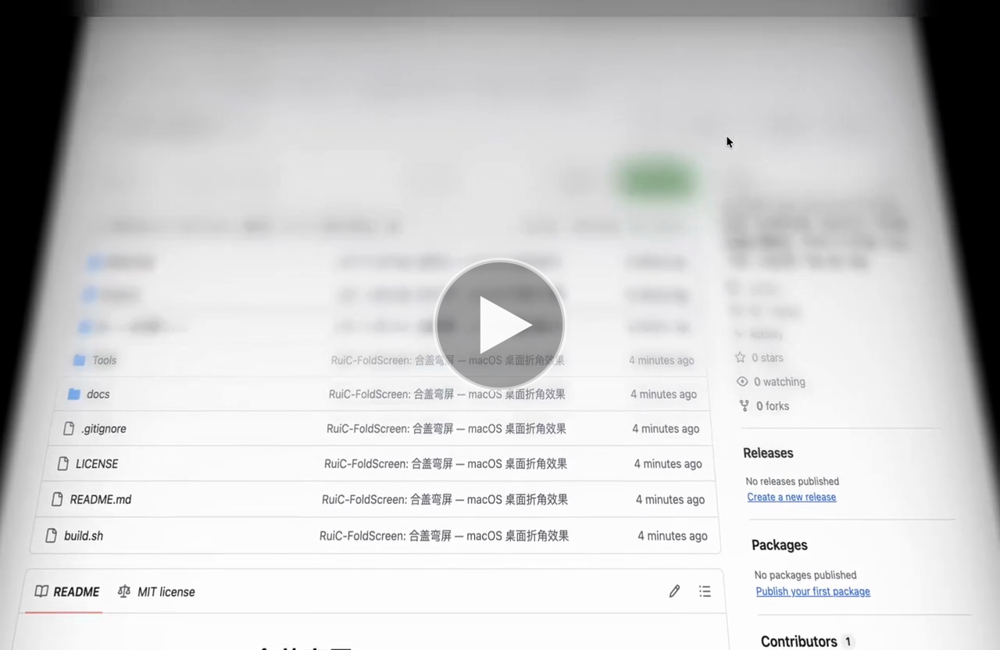
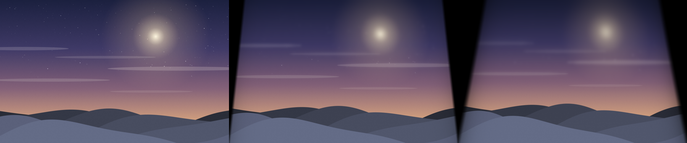
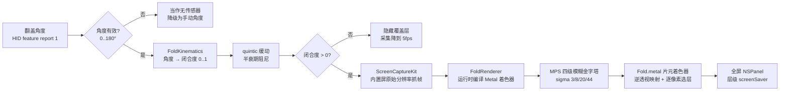

# RuiC-FoldScreen · 合盖弯屏

**合上 MacBook 盖子的过程里，让桌面跟着一起弯下去。**

一个 macOS 菜单栏小程序：读取笔记本内置的翻盖角度传感器，按视角投影把桌面压出折角，越靠上越模糊，直到屏幕熄灭。免费、开源、纯本地。


> 上面这段就是实际效果（用真实渲染管线导出，非手绘示意）：合上盖子的过程里，桌面跟着一起弯——上方两角向内收拢成梯形，越靠上越虚，转轴一侧始终保持清晰。

### 真机实录

[](docs/fold-demo.mp4)

**点击封面播放**（4.8 秒，无音轨）。这段录的是真实桌面，不是合成画面：浏览器里打开本仓库页面，合盖时整个页面被实时弯折虚化——注意顶部的文件名已经糊成一片，底部的 `LICENSE`、`README.md`、`build.sh` 仍然清晰可读，这就是「越靠上越虚」的梯度。

> 为保护隐私，录制时浏览器标签栏已做模糊处理；画面中保留的地址栏内容是本仓库的公开地址。

灵感来自折叠屏手机的开合动画，以及 [Bendy](https://trybendy.app/) 对这一效果的公开实现。本项目是一份**独立的复刻重写**，代码从零实现，与 Bendy 及 Apple 均无关联。

### 三个阶段对照



从左到右：盖子打开（桌面原样）→ 折到一半 → 完全折起。静态图比 GIF 清晰，方便看清折角的边缘细节。

---

## 它能做什么

- **跟着盖子走**：翻盖角度实时驱动桌面弯折，合多少弯多少，不是动画播放
- **三档风格**：轻纱（均衡）／折痕（折角最硬）／雾面（虚化最重）
- **三段可调**：透视、虚化、阴影分别可调，另有「完全展开角度」阈值
- **带预览**：设置里内置一段画面，不需要屏幕录制权限就能看效果
- **三处克制**：只作用于内置屏；Escape 随时暂停；睡眠／换显示器后自动重连
- **不联网**：画面帧只在内存里过一手，不落盘、不上传、不录音

## 环境要求

| 项目 | 要求 |
|---|---|
| 系统 | macOS 14 及以上 |
| 机型 | Apple 芯片 MacBook（需要翻盖角度传感器） |
| 实测 | MacBook Air M4（Mac16,12），macOS 26.5 |
| 构建 | 只需 Xcode 命令行工具（**不需要装 Xcode**） |

翻盖传感器的报文格式苹果没有公开，不同机型可能读不到。读不到时程序会明说，并且仍然可以用设置里的预览看效果。

## 构建与运行

```sh
./build.sh
open dist/RuiC-FoldScreen.app
```

首次启动需要在「系统设置 → 隐私与安全性 → 屏幕与系统音频录制」里勾选本应用——效果要读到屏幕内容才能把它弯起来。授权后程序会自动接上，不用重新开关。

构建产物是 `dist/RuiC-FoldScreen.app`。

### 关于签名（重要）

`build.sh` 第一次运行会在你的登录钥匙串里创建一个自签名证书 **RuiC-FoldScreen Local Signing**，并用它给 App 签名。

这不是多此一举。TCC（macOS 的权限库）把「谁被授权了」记成一条**代码要求**：

- **ad-hoc 签名**（`codesign -s -`）的要求是**二进制哈希**。改一行代码重新编译，哈希就变了，系统认为这是另一个 App，你之前勾的权限**直接失效**，只能重新授权。
- **证书签名**的要求是**证书本身**（`certificate root = H"3fbd…"`）。重新编译时哈希会变，要求不变，权限一直有效。

所以如果你看到「明明勾了权限，它还是说没有」，几乎一定是签名方式的问题。可以用这两条命令自查：

```sh
# 应该显示 certificate root = H"…"，如果显示 cdhash = H"…" 就是 ad-hoc
codesign -d -r- dist/RuiC-FoldScreen.app

# 清掉记录错乱的那条权限，重启 App 后会重新询问
tccutil reset ScreenCapture app.ruic.foldscreen
```

这个证书只在本机有效，不是 Apple 签发的，**不能用来分发**。要正式发布还是得用 Developer ID。

### 权限相关行为

没有权限时，程序会进入等待状态并安静地轮询 `CGPreflightScreenCaptureAccess`——这个接口只读答案、不碰采集栈，所以**不会弹任何系统提示**。设置页里有「重新检查」和「重新打开」两个按钮：前者立刻重查，后者用于 macOS 已记录权限但当前进程不生效的情况（这一点上系统偶尔需要重启应用）。

## 命令行

程序自带几条无界面入口，方便验证和排查：

```sh
BIN=dist/RuiC-FoldScreen.app/Contents/MacOS/RuiC-FoldScreen

$BIN --selftest                    # 23 项自检：折角数学、着色器、传感器、离屏渲染
$BIN --sensor                      # 读一次翻盖角度
$BIN --render-frames out --hold .8 # 用真实渲染管线导出折角序列，供人工查看
$BIN --scripted-lid                # 用脚本化的翻盖角度启动（没有真实盖子也能跑）
$BIN --smoke                       # 拉起完整链路并在 3 秒后写诊断报告
```

`--render-frames` 走的是**和覆盖层完全相同的渲染管线**，所以它导出的画面就是程序实际会显示的画面，可以直接用来做视觉验收：

```sh
$BIN --render-frames out --size 1280x800 --steps 6 --preset 1
```

仓库里那段演示 GIF 就是用这个入口做的，配方如下（可自行改分辨率与步数）：

```sh
# 1. 导出一次完整的「开 → 合 → 开」循环。--cycle 让首尾都停在桌面原样，
#    所以循环播放不会跳帧；--no-grain 去掉抗色带噪点——屏幕上看它是好事，
#    但 GIF 只有 256 色，噪点会被量化成逐像素闪烁，帧间压缩直接失效。
$BIN --render-frames frames --size 800x500 --steps 54 --cycle --no-grain

# 2. 合成 GIF。bayer_scale=3 是关键：调大到 5 体积能省三成，
#    但月亮光晕那种大面积平滑渐变会出现肉眼可见的同心圆色带。
ffmpeg -y -framerate 18 -pattern_type glob -i 'frames/fold-*.png' \
  -vf "fps=18,scale=800:-1:flags=lanczos,split[s0][s1];\
[s0]palettegen=max_colors=128:stats_mode=diff[p];\
[s1][p]paletteuse=dither=bayer:bayer_scale=3:diff_mode=rectangle" \
  -loop 0 fold-demo.gif
```

## ⚙️ 工作原理



### 核心链路要点

1. **角度从哪来**：内置传感器是一个 Apple 厂商的 HID 设备，主用途页 `0x20`、用途 `0x8A`，角度以 feature report 1 的形式返回，偏移 1 起两个小端字节。只读、非独占，不装驱动、不要 root。读到超范围的值一律丢弃，宁可不弯也不乱弯。

2. **角度怎么变成折角**：`FoldKinematics` 把「离完全展开还有多少度」压进 `0..1`，用五次 smootherstep 而不是三次 smoothstep——两者首尾都静止，但五次曲线两端没有加速度断点，桌面进入和退出折角时不会有一声「咯噔」。再用半衰期阻尼把逐帧抖动抹平（用半衰期而不是每帧系数，帧率变了也不会走样）。

3. **折角是算出来的，不是画出来的**：把屏幕当成一块沿底边（转轴）铰接、随盖子向后倾倒的平面，按真实透视投影，再归一化到上下边缘都钉住，得到正向映射 `d = s(1+k)/(1+sk)`。着色器需要反方向，于是解出 `s = d/(1+k(1−d))`。水平方向的收拢用同一个深度因子，所以顶部收窄、转轴处保持满宽——这正是画面里那个梯形。

4. **模糊为什么分层**：逐像素重跑高斯模糊太贵。改成每帧在四分之一分辨率上预先算好四级不同 sigma 的模糊，着色器按该像素的模糊半径在相邻两级之间插值。模糊半径与离观察者的距离成正比，所以集中在顶部（`pow(h,3)`），中间保持可读、底部保持锐利。半径同时乘了闭合度，盖子打开时桌面会跟着恢复清晰。

5. **为什么不装 Xcode 也能编译**：Metal 离线编译器随 Xcode 分发，命令行工具里没有。这里把 `.metal` 在构建时嵌成 Swift 字符串，启动时由 `MTLDevice.makeLibrary(source:)` 现场编译。因此整套工具链就是 `swiftc` 加 macOS SDK。只读的构建脚本 `Tools/embed_shader.py` 负责嵌入，`.metal` 文件仍可正常高亮和 diff。

## 项目结构

```
Shaders/Fold.metal              折角着色器（唯一需要动效果的地方）
Sources/FoldScreen/
  Core/FoldKinematics.swift     纯数学：闭合度曲线、阻尼、透视投影
  Core/LidAngle.swift           传感器接缝 + HID 实现 + 脚本化实现
  Core/FoldSettings.swift       设置值类型、预设、着色器 uniform 装配
  Core/LiveFold.swift           总控：状态机、帧循环、系统事件
  Capture/DesktopMirror.swift   ScreenCaptureKit 抓帧 + 静帧实现
  Render/FoldRenderer.swift     Metal 管线、模糊金字塔、离屏快照
  Render/OverlaySurface.swift   全屏覆盖层窗口
  Render/PreviewArtwork.swift   设置预览用的画面（代码绘制）
  UI/                          菜单栏、设置窗口、预览
  Support/                     热键、登录项、无界面自检
Tools/embed_shader.py           把着色器嵌进二进制
Tools/MakeIcon.swift            代码绘制应用图标
build.sh                        唯一构建入口
```

## 已知限制

- 只处理内置屏，外接显示器不参与
- 翻盖传感器未公开，换机型可能读不到
- Escape 是全局热键，效果可见的那几秒会占用该按键
- 未做公证，首次打开可能需要在「隐私与安全性」里放行

## 许可

[MIT](LICENSE)。折叠桌面这一主意最早的公开实现是 [Bendy](https://trybendy.app/)，本项目是独立复刻，与 Bendy 及 Apple 均无关联。

---

## 赞赏支持

<p align="center">
  
</p>

<p align="center">微信扫码赞赏</p>
